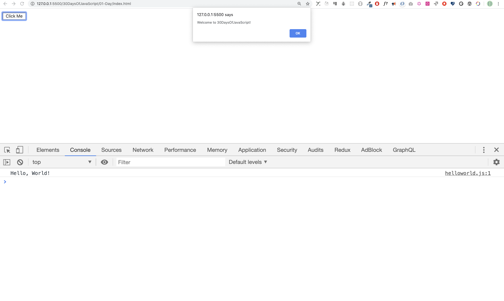
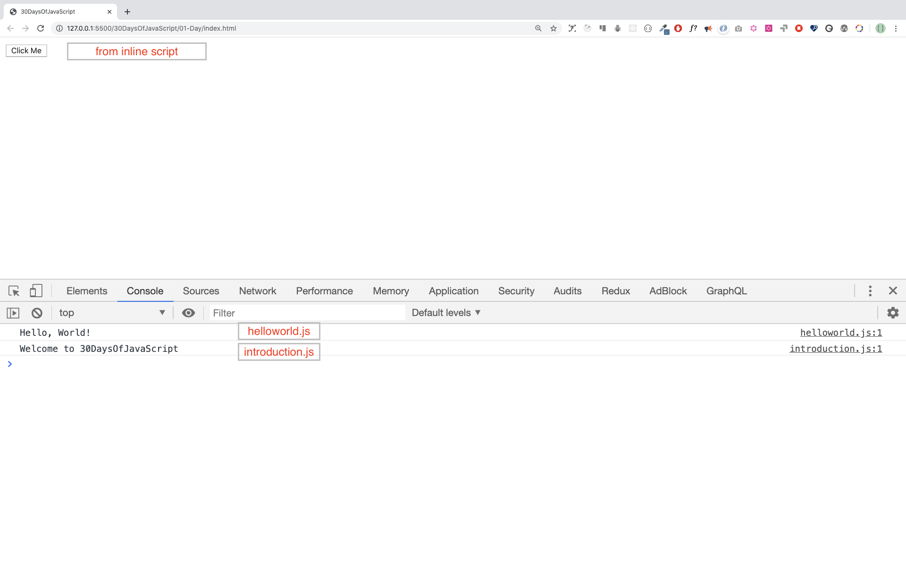

# 30 Günlük JavaScript 

| # Gün |                                                                       Bölümler                                                                        |
| ----- | :-------------------------------------------------------------------------------------------------------------------------------------------------: |
| 01    |                                                             [Başlangıç](./readMe.md)                                                             |
| 02    |                                               [Veri Tipleri](./02_Gün_Veri_Tipleri/02_gün_veri_tipleri.md)                                                |
| 03    |                             [Booleans, Operatörler, Tarih](./03_Day_Booleans_operators_date/03_booleans_operators_date.md)                             |
| 04    |                                            [Şart Blokları](./04_Day_Conditionals/04_day_conditionals.md)                                             |
| 05    |                                                     [Diziler](./05_Day_Arrays/05_day_arrays.md)                                                      |
| 06    |                                                       [Dögünler](./06_Day_Loops/06_day_loops.md)                                                       |
| 07    |                                                 [Fonksiyonlar (Functions)](./07_Day_Functions/07_day_functions.md)                                                 |
| 08    |                                                    [Nesneler (Objects)](./08_Day_Objects/08_day_objects.md)                                                    |
| 09    |                             [Daha Yüksek Dereceli Fonksiyonlar (Higher Order Functions)](./09_Day_Higher_order_functions/09_day_higher_order_functions.md)                              |
| 10    |                                           [Setler ve Haritalar (Sets and Maps)](./10_Day_Sets_and_Maps/10_day_Sets_and_Maps.md)                                           |
| 11    |                      [Yıkım ve Yayılma (Destructuring and Spreading)](./11_Day_Destructuring_and_spreading/11_day_destructuring_and_spreading.md)                      |
| 12    |                                  [Düzenli ifadeler (Regular Expressions](./12_Day_Regular_expressions/12_day_regular_expressions.md)                                  |
| 13    |                             [Konsol Nesne Yöntemleri (Console Object Methods)](./13_Day_Console_object_methods/13_day_console_object_methods.md)                              |
| 14    |                                         [Hata yönetimi (Error Handling)](./14_Day_Error_handling/14_day_error_handling.md)                                          |
| 15    |                                                    [Sınıflar (Classes)](./15_Day_Classes/15_day_classes.md)                                                    |
| 16    |                                                        [JSON](./16_Day_JSON/16_day_json.md)                                                         |
| 17    |                                            [Web Depoları (Web Storages)](./17_Day_Web_storages/17_day_web_storages.md)                                             |
| 18    |                                                  [Vaatler (Promises)](./18_Day_Promises/18_day_promises.md)                                                   |
| 19    |                                                   [Kapama (Closure)](./19_Day_Closures/19_day_closures.md)                                                   |
| 20    |                                  [Temiz Kod Yazma (Writing Clean Code)](./20_Day_Writing_clean_codes/20_day_writing_clean_codes.md)                                   |
| 21    |                                                          [DOM](./21_Day_DOM/21_day_dom.md)                                                          |
| 22    |                            [DOM Nesnesini Manipüle Etme (Manipulating DOM Object)](./22_Day_Manipulating_DOM_object/22_day_manipulating_DOM_object.md)                            |
| 23    |                                        [Olay Dinleyicileri (Event Listeners)](./23_Day_Event_listeners/23_day_event_listeners.md)                                        |
| 24    |                             [Mini Proje: Güneş Sistemi](./24_Day_Project_solar_system/24_day_project_solar_system.md)                              |
| 25    | [Mini Proje: Dünya Ülkeleri Veri Görselleştirme 1](./25_Day_World_countries_data_visualization_1/25_day_world_countries_data_visualization_1.md) |
| 26    | [Mini Proje: Dünya Ülkeleri Veri Görselleştirme 2](./26_Day_World_countries_data_visualization_2/26_day_world_countries_data_visualization_2.md) |
| 27    |                             [Mini Proje: Portföy](./27_Day_Mini_project_portfolio/27_day_mini_project_portfolio.md)                             |
| 28    |                          [Mini Proje: Lider Tablosu](./28_Day_Mini_project_leaderboard/28_day_mini_project_leaderboard.md)                          |
| 29    |             [Mini Proje: Animasyon karakterleri](./29_Day_Mini_project_animating_characters/29_day_mini_project_animating_characters.md)             |
| 30    |                                     [Final Projesi](./30_Day_Mini_project_final/30_day_mini_project_final.md)                                      


-------------------NOT: GİRİŞ SAYFASI VE BÖLÜM BAŞLIKLARI HARİÇ DİĞER ALANDAKİ KODLAR, DEĞİŞKENLER, NESNELER VB. İNGİLİZCE OLACAKTIR. HEM İNGİLİZCENİZ GELİŞİR HEMDE KODLARI ORJİNAL HELLERİYLE ÖĞRENMİŞ OLURSUNUZ. ---------------------------------
-------------------NOT: Hiç Bir Kodlamada Türkçe karakter kullanmayın. "ç","ü""ö""İ" bunları unut!
🧡🧡🧡 Hadi Bakalım Çocuklar, Başlayalım🧡🧡🧡

<div>
<small>Bu yazının asıl <strong>sahibini</strong> destekleyerek teşekkür edebilirsiniz, diyecem ama Türkiye'de Paypal yok. </small> <br />  
<a href = "https://www.paypal.me/asabeneh"></a>
</div>

<div align="center">
  <h1> 30 Günde JavaScript: Başlangıç</h1>
  <a class="header-badge" target="_blank" href="https://www.linkedin.com/in/asabeneh/">
  
  </a>
  <a class="header-badge" target="_blank" href="https://twitter.com/Asabeneh">
  
  </a>

<sub>Yazar:
<a href="https://www.linkedin.com/in/asabeneh/" target="_blank">Asabeneh Yetayeh</a><br>
<small> January, 2020</small>
</sub>

<div>

🇬🇧 [English](./readMe.md)
🇪🇸 [Spanish](./Spanish/readme.md)
🇷🇺 [Russian](./RU/README.md)
🇦🇿 [Azerbaijan](./Azerbaijani/readMe.md)
KR [Korean](./Korea/README.md)
🇻🇳 [Vietnamese](./Vietnamese/README.md)
TR [Turkish](./Turkish/README.md)

</div>

</div>
</div>

[2. Gün >>](./02_Gün_Veri_Tipleri/02_gün_veri_tipleri.)


- [30 gündeJavaScript](#30-days-of-javascript)
- [📔 1. Gün](#-1.-gün)
	- [Başlarken](#başlarken)
	- [Gereksinimler](#gereksinimler)
	- [Kurulum](#kurulum)
		- [Node.js Yükleme](#nodejs-yükleme)
		- [Tarayıcı](#browser)
			- [Google Chrome Yükleme](#google-chrome-yükleme)
			- [Google Chrome Konsolunu Açma](#google-chrome-konsolunu-açma)
			- [Tarayıcı Konsolunda Kod Yazma](#tarayıcı-konsolunda-kod-yazma)
				- [Console.log](#consolelog)
				- [Çoklu Argümanlarla Console.log ](#çoklu-argümanlarla-consolelog)
				- [Yorumlar](#yorumlar)
				- [Syntax](#syntax)
			- [Arithmetikler](#arithmetikler)
		- [Kod Editörü](#kod-editörü)
			- [Visual Studio Code'u Yükleme](#visual-studio-code'u-yükleme)
			- [Visual Studio Kodu Nasıl Kullanılır](#visual-studio-kodu-nasıl-kullanılır)
	- [Bir Web Sayfasına JavaScript Ekleme](#bir-web-sayfasına-javaScript-ekleme)
		- [Satır İçi Komut Dosyası](#satır-içi-komut-dosyası)
		- [Dahili Komut Dosyası](#dahili-komut-dosyası)
		- [Harici Komut Dosyası](#harici-komut-dosyası)
		- [Birden Fazla Harici Komut Dosyası](#birden-fazla-harici-komut-dosyası)
	- [Veri türlerine giriş](#veri-türlerine-giriş)
		- [Sayılar](#sayılar)
		- [Strings](#strings)
		- [Booleans](#booleans)
		- [Undefined-Tanımsız](#undefined-tanımsız)
		- [Null](#null)
	- [Veri Türlerini Kontrol Etme](#veri-türlerini-kontrol-etme)
	- [Tekrar Yorumlar](#tekrar-yorumlar)
	- [Variables](#variables)
- [💻 1. Gün: Alıştırmaları](#-day-1-exercises)

# 📔 1. Gün

## Başlarken

**Tebrikler** 30 günlük JavaScript programlama etkinliğine katıldın. Bu etkinlikte, bir JavaScript programcısı olmak için ihtiyacınız olan her şeyi ve genel olarak tüm programlama kavramını öğreneceksiniz. Etkinliğin sonunda 30GündeJavaScript programlama etkinliği tamamlama sertifikası alacaksınız. Yardıma ihtiyacınız olursa veya başkalarına yardım etmek isterseniz [telegram grubuna](https://t.me/ThirtyDaysOfJavaScript) katılabilirsiniz.

**A 30GündeJavaScript**, hem yeni başlayanlar hem de ileri düzey JavaScript geliştiricileri için bir kılavuzdur. JavaScript'e hoş geldiniz. JavaScript web'in dilidir. JavaScript kullanmaktan ve öğretmekten zevk alıyorum ve umarım siz de öyle yaparsınız.

Bu adım adım JavaScript etkinliğinde, insanlık tarihinin en popüler programlama dili olan JavaScript'i öğreneceksiniz.
JavaScript, **_web sitelerine etkileşim eklemek, mobil uygulamalar, masaüstü uygulamaları, oyunlar geliştirmek için kullanılır_** ve günümüzde JavaScript, **_makine öğrenimi_** ve **_AI_** için kullanılabilir.
**_JavaScript (JS)_** son yıllarda popülaritesini artırmış ve lider olmuştur.
altı yıl üst üste programlama dilidir ve en çok kullanılan programlama dilidir.
Github.

## Gereksinimler

Bu zorluğun üstesinden gelmek için önceden programlama bilgisi gerekmez. Yalnızca şunlara ihtiyacınız var:

1. Motivasyon
2. Bilgisayar
3. İnternet
4. Tarayıcı (Google Chrome)
5. Kod Editörü

## Kurulum

Yukarıda saydığımız şeylere sahipseniz, artık JavaScript öğrenmeyede hazırsınız demek.

### Node.js Yükleme

Node.js'ye şu anda ihtiyacınız olmayabilir, ancak daha sonra ihtiyacınız olacak. Düzenlemek[node.js](https://nodejs.org/en/).


İndirdikten sonra çift tıklayın ve kurun


Bilgisayarımızda _Node.js_ kurulu olup olmadığını cihaz terminalimizi veya komut istemini açarak kontrol edebiliriz.

```sh
asabeneh $ node -v
v12.14.0
```

"Bu öğreticiyi hazırlarken Node sürüm 12.14.0 kullanıyordum, ancak şimdi indirmek için önerilen Node.js sürümü v14.17.6'dır, bu materyali kullandığınızda daha yüksek bir Node.js sürümüne sahip olabilirsiniz" demiş yazar. Şuan en son sürüm olarak v17.8 var.

### Tarayıcı

Orada birçok tarayıcı var. Ancak, Google Chrome'u kullamak bizim için daha ideal olacak.

#### Google Chrome Yükleme

Yükleyin [Google Chrome](https://www.google.com/chrome/). Tarayıcı konsoluna küçük JavaScript kodları yazabiliriz, ancak tarayıcı konsolunu uygulama geliştirmek için kullanmayız.


#### Google Chrome Konsolunu Açma

Google Chrome konsolunu, tarayıcının sağ üst köşesindeki üç noktayı tıklayarak, _Diğer araçlar -> Geliştirici araçları_'nı seçerek veya bir klavye kısayolu kullanarak açabilirsiniz.


Bir klavye kısayolu kullanarak Chrome konsolunu açmak için.

```sh
Mac
Command+Option+J

Windows/Linux:
Ctl+Shift+J
```


Google Chrome konsolunu açtıktan sonra işaretli düğmeleri keşfetmeyi deneyin. Zamanımızın çoğunu Konsolda geçireceğiz. Konsol, JavaScript kodunuzun gittiği yerdir. Google Konsol V8 motoru, JavaScript kodunuzu makine koduna değiştirir.
Google Chrome konsoluna bir JavaScript kodu yazalım:


#### Tarayıcı Konsolunda Kod Yazma

Herhangi bir JavaScript kodunu Google konsoluna veya herhangi bir tarayıcı konsoluna yazabiliriz. Ancak bu meydan okuma için yalnızca Google Chrome konsoluna odaklanıyoruz. Aşağıdakileri kullanarak konsolu açın:
```sh
Mac
Command+Option+I

Windows:
Ctl+Shift+I
```

##### Console.log

İlk JavaScript kodumuzu yazmak için yerleşik bir işlev **console.log()** kullandık. Girdi verisi olarak bir argüman ilettik ve fonksiyon çıktıyı görüntüler. Console.log() işlevinde girdi verisi veya argüman olarak `'Merhaba, Dünya''yı geçtik.

```js
console.log('Merhaba, Dünya!')
```

##### Birden Çok Argümanlı Console.log

**`console.log()`** işlevi, virgülle ayrılmış birden çok parametre alabilir. Sözdizimi şuna benzer:**`console.log(param1, param2, param3)`**


```js
console.log('Hello', 'World', '!')
console.log('HAPPY', 'NEW', 'YEAR', 2020)
console.log('Welcome', 'to', 30, 'Days', 'Of', 'JavaScript')
```

Yukarıdaki kod parçasından da görebileceğiniz gibi, _`console.log()`_ birden fazla argüman alabilir.

Tebrikler! İlk JavaScript kodunuzu _`console.log()`_ kullanarak yazdınız.

##### Yorumlar

Kodumuza yorum ekleyebiliriz. Yorumlar, kodu daha okunaklı kılmak ve kodumuzda açıklamalar bırakmak için çok önemlidir. JavaScript, kodumuzun yorum bölümünü yürütmez. JavaScript'te, JavaScript'te // ile başlayan herhangi bir metin satırı bir yorumdur ve bunun gibi `//` içine alınmış her şey de bir yorumdur.

**Örnek: Tek Satırlı Yorum**

```js
// Bu ilk yorum
// Bu ikinci yorum
// Ben tek satırlık bir yorumum
```

**Örnek: Çok Satırlı Yorum**

```js
/*
Bu çok satırlı bir yorumdur
 Çok satırlı yorumlar birden çok satır alabilir
 JavaScript web'in dilidir
 */
```

##### Syntax

Programlama dilleri insan dillerine benzer. İngilizce veya diğer birçok dil, anlamlı bir mesaj iletmek için kelimeler, deyimler, cümleler, bileşik cümleler ve daha fazlasını kullanır. Sözdiziminin İngilizce anlamı, _bir dilde iyi oluşturulmuş cümleler oluşturmak için sözcüklerin ve tümceciklerin düzenlenmesidir_. Sözdiziminin teknik tanımı, bir bilgisayar dilindeki ifadelerin yapısıdır. Programlama dillerinin söz dizimi vardır. JavaScript bir programlama dilidir ve diğer programlama dilleri gibi kendi söz dizimine sahiptir. JavaScript'in anladığı bir sözdizimi yazmazsak, farklı türde hatalar ortaya çıkar. Farklı JavaScript hata türlerini daha sonra keşfedeceğiz. Şimdilik sözdizimi hatalarını görelim.


Ben bilerek bie hata yaptım. Sonuç olarak, konsol sözdizimi hatalarımızı yüzümüze vurdu. Aslında, sözdizimi çok bilgilendirici. Ne tür bir hata yapıldığını bildirir. Hata geri bildirim kılavuzunu okuyarak sözdizimini düzeltebilir ve sorunu çözebiliriz. Bir programdaki hataları belirleme ve kaldırma işlemine hata ayıklama denir. Hataları düzeltelim:

```js
console.log('Selam Dünya!')
console.log('Selam Dünya!')
```

Şimdiye kadar, _`console.log()`_ kullanarak metnin nasıl görüntüleneceğini gördük. _`console.log()`_ kullanarak metin veya dize yazdırıyorsak, metnin tek tırnak, çift tırnak veya ters tik içinde olması gerekir.
**Örnek:**

```js
console.log('Selam Dünya!')
console.log("Selam Dünya!")
console.log(`Selam Dünya!`)
```

#### Aritmetikler

Şimdi, sayı veri türleri için Google Chrome konsolunda _`console.log()`_ kullanarak JavaScript kodları yazma konusunda daha fazla alıştırma yapalım.
Metne ek olarak JavaScript kullanarak matematiksel hesaplamalar da yapabiliriz. Aşağıdaki basit hesaplamaları yapalım.
**_`console.log()`_** işlevi olmadan doğrudan Google Chrome konsoluna JavaScript kodu yazmak mümkündür. Ancak, bu girişe dahil edilmiştir çünkü bu zorluğun çoğu, işlevin kullanımının zorunlu olacağı bir metin düzenleyicide yer alacaktır. Konsoldaki talimatlarla doğrudan oynayabilirsiniz.


```js
console.log(2 + 3) // Addition - Toplama
console.log(3 - 2) // Subtraction - Çıkarma
console.log(2 * 3) // Multiplication - Çarpma
console.log(3 / 2) // Division - Bölme
console.log(3 % 2) // Modulus - finding remainder - kalanlı bölme
console.log(3 ** 2) // Exponentiation 3 ** 2 == 3 * 3 - üstünü alma
```

### Kod Editörü

Kodlarımızı tarayıcı konsoluna yazabiliriz ama daha büyük projeler için olmayacak. Gerçek bir çalışma ortamında, geliştiriciler kodlarını yazmak için farklı kod düzenleyicileri kullanır. Bu 30 günlük JavaScript maceramızda Visual Studio Code kullanacağız.

#### Visual Studio Code'u Yükleme

Visual Studio Code, çok popüler bir açık kaynak metin düzenleyicisidir. [Visual Studio Code'u indirmenizi](https://code.visualstudio.com/) tavsiye ederim, ancak diğer editörlerden yanaysanız, elinizdekilerle takip etmekten çekinmeyin.


Visual Studio Code yüklediyseniz hemen kullanmaya başlayalım.

#### Visual Studio Kodu Nasıl Kullanılır

Simgesine çift tıklayarak Visual Studio Code'u açın. Açtığınızda, bu tür bir arayüz elde edeceksiniz. Etiketli simgelerle etkileşim kurmayı deneyin.


## Bir Web Sayfasına JavaScript Ekleme

JavaScript bir web sayfasına üç farklı şekilde eklenebilir:

- **_satır içi komut dosyası_**
- **_Dahili komut dosyası_**
- **_Harici komut dosyası_**
- **_Birden çok Harici komut dosyası_**

The following sections show different ways of adding JavaScript code to your web page.

### Satır İçi Komut Dosyası

Masaüstünüzde veya herhangi bir yerde bir proje klasörü oluşturun, buna 30DaysOfJS adını verin ve proje klasöründe bir **_`index.html`_** dosyası oluşturun. Ardından aşağıdaki kodu yapıştırın ve bir tarayıcıda açın, örneğin [Chrome](https://www.google.com/chrome/).

```html
<!DOCTYPE html>
<html lang="en">
  <head>
    <title>30GündeJavaScript:Harici komut dosyası</title>
  </head>
  <body>
    <button onclick="alert('Hoşgeldiniz 30GündeJavaScript')">Buraya Tıkla</button>
  </body>
</html>
```

Now, you just wrote your first inline script. We can create a pop up alert message using the _`alert()`_ built-in function.

### Dahili Komut Dosyası

The internal script can be written in the _`head`_ or the _`body`_, but it is preferred to put it on the body of the HTML document.
First, let us write on the head part of the page.

```html
<!DOCTYPE html>
<html lang="en">
  <head>
    <title>30GündeJavaScript:Harici komut dosyası</title>
    <script>
      console.log('Hoşgeldiniz 30GündeJavaScript')
    </script>
  </head>
  <body></body>
</html>
```

Çoğu zaman dahili bir betiği bu şekilde yazarız. JavaScript kodunun _body_ kısmına yazılması en çok tercih edilen seçenektir. `console.log()` çıktısını görmek için tarayıcı konsolunu açın.

```html
<!DOCTYPE html>
<html lang="en">
  <head>
    <title>30GündeJavaScript:Harici komut dosyası</title>
  </head>
  <body>
    <button onclick="alert('Hoşgeldiniz 30GündeJavaScript!');">Buraya Tıkla</button>
    <script>
      console.log('Hoşgeldiniz 30GündeJavaScript')
    </script>
  </body>
</html>
```

`console.log()` çıktıyı görmek için tarayıcı konsolunu açın.



### Harici Komut Dosyası

Dahili komut dosyasına benzer şekilde, harici komut dosyası bağlantısı _header_ veya _body_ üzerinde olabilir, ancak _body_ yerleştirilmesi tercih edilir.
Öncelikle .js uzantılı harici bir JavaScript dosyası oluşturmalıyız. .js uzantılı tüm dosyalar JavaScript dosyalarıdır. Proje dizininizin içine giris.js adında bir dosya oluşturun ve aşağıdaki kodu yazın ve bu .js dosyasını gövdenin en altına bağlayın.

```js
console.log('Hoşgeldiniz 30GündeJavaScript')
```

_head_ içindeki harici komut dosyaları:

```html
<!DOCTYPE html>
<html lang="en">
  <head>
    <title>30GündeJavaScript:Harici komut dosyası</title>
    <script src="introduction.js"></script>
  </head>
  <body></body>
</html>
```

_body_ içindeki harici komut dosyaları:

```html
<!DOCTYPE html>
<html lang="en">
  <head>
    <title>30GündeJavaScript:Harici komut dosyası</title>
  </head>
  <body>
    <!-- JavaScript harici bağlantısı başlıkta veya gövdede olabilir --> 
    <!-- Gövdenin kapanış etiketinden önce, harici JavaScript komut dosyasını koymak için önerilen yer -->
    <script src="introduction.js"></script>
  </body>
</html>
```

`console.log()`çıktısını görmek için tarayıcı konsolunu açın. 

### Birden Fazla Harici Komut Dosyası

Ayrıca birden fazla harici JavaScript dosyasını bir web sayfasına bağlayabiliriz.
30GündeJS klasörü içerisinde bir `helloworld.js` dosyası oluşturun ve aşağıdaki kodu yazın.

```js
console.log('30GündeJavaScript Hoşgeldiniz!')
```

```html
<!DOCTYPE html>
<html lang="en">
  <head>
    <title>Birden Fazla Harici Komut Dosyası</title>
  </head>
  <body>
    <script src="./helloworld.js"></script>
    <script src="./introduction.js"></script>
  </body>
</html>
```

_main.js dosyanız diğer tüm komut dosyalarının altında olmalıdır_. Bunu hatırlamak çok önemlidir.


## Veri türlerine giriş

JavaScript'te ve ayrıca diğer programlama dillerinde farklı veri türleri vardır. Aşağıdakiler JavaScript ilkel veri türleridir: _String, Number, Boolean, undefined, Null_ ve _Symbol_.
### Sayılar

- Integers: Tamsayı (negatif, sıfır ve pozitif) sayılar
  Örneğin:
  ... -3, -2, -1, 0, 1, 2, 3 ...
- Float-point numbers: Ondalık sayı
  Örneğin
  ... -3.5, -2.25, -1.0, 0.0, 1.1, 2.2, 3.5 ...

### Strings

'İki tek tırnak' "çift tırnak" veya `ters tırnak` arasında bir veya daha fazla karakterden oluşan bir koleksiyon.

**Örnek:**

```js
'a'
'Asabeneh'
"Üçler"
'Finlandiya'
'JavaScript güzel bir programlama dilidir'
'öğretmeyi seviyorum'
'umarım ilk günün tadını çıkarırsın'
`Ayrıca bir backtick kullanarak bir dize oluşturabiliriz.`
'Bir dize, bir karakter kadar küçük veya birçok sayfa kadar büyük olabilir.'
'Tek tırnak, çift tırnak veya ters tik altındaki herhangi bir veri türü bir dizgedir.'
```

### Booleans

Bir boolean değeri, _true_ veya _false_'tur. Herhangi bir karşılaştırma, doğru veya yanlış olan bir boolean değeri döndürür.

Boolean veri türü, doğru veya yanlış bir değerdir.

**Örnek:**

```js
true // iışık yanıyorsa, değer doğrudur
false // ışık kapalıysa, değer yanlıştır
```

### Undefined -Tanımsız

JavaScript'te bir değişkene değer atamazsak değer tanımsızdır. Buna ek olarak, bir işlev hiçbir şey döndürmüyorsa, tanımsız döndürür.

```js
let firstName
console.log(firstName) // undefined, tanımsız, çünkü henüz bir değere atanmamış
```

### Null

JavaScript'te null boş bir değer anlamına gelir.

```js
let emptyValue = null
```

## Veri Türlerini Kontrol Etme

Belirli bir değişkenin veri türünü kontrol etmek için **typeof** operatörünü kullanırız. Aşağıdaki örneğe bakın.

```js
console.log(typeof 'Asabeneh') // string
console.log(typeof 5) // number
console.log(typeof true) // boolean
console.log(typeof null) // object type
console.log(typeof undefined) // undefined
```

## Tekrar Yorumlar

JavaScript'te yorum yapmanın diğer programlama dillerine benzer olduğunu unutmayın. Yorumlar, kodunuzu daha okunabilir hale getirmek için önemlidir.
Yorum yapmanın iki yolu vardır:

- _Tek satırlık yorum_
- _Çok satırlı yorum_

```js
// kodun kendisini tek bir yorumla yorumlamak
// let firstName = 'Asabeneh'; tek satırlık yorum
// let lastName = 'Yetayeh'; tek satırlık yorum
```

Multiline commenting:

```js
/*
  let lokasyon = 'Helsinki';
  let yas = 100;
  let medeniDurum = true;
  Bu çok satırlı bir yorumdur
*/
```

## Variables

Variables are _containers_ of data. Variables are used to _store_ data in a memory location. When a variable is declared, a memory location is reserved. When a variable is assigned to a value (data), the memory space will be filled with that data. To declare a variable, we use _var_, _let_, or _const_ keywords.

Daha sonra değiştireceğimiz değişkenler için _let_ kullanırız. Eğer yazılan veriler sabit kalacak ve  hiç değişmeyecekse, _const_ kullanırız. Örneğin PI, ülke adı, yerçekimi değişmez ve _const_ kullanabiliriz. _var_ değişkenini kullanmanızı tavsiye etmiyorum. . _var_, _let_ ve _const_ hakkında diğer bölümlerde (kapsam) daha detaylı konuşacağız. Şimdilik yukarıdaki açıklama yeterlidir.

Geçerli bir JavaScript değişken adı aşağıdaki kurallara uymalıdır:

- Bir JavaScript değişken adı bir sayı ile başlamamalıdır.
- Bir JavaScript değişken adı, dolar işareti ve alt çizgi dışında özel karakterlere izin vermez.
- Bir JavaScript değişken adı, bir camelCase kuralına uyar.
- Bir JavaScript değişken adında kelimeler arasında boşluk olmamalıdır.

Aşağıda geçerli JavaScript değişkenlerine örnekler verilmiştir.

```js
takmaIsim
soyIsim
ülke
sehir
yasadigiSehir
yas
medeniDurum

soy_isim
takma_isim
medeniz_durum
yasadigi_sehir

sayi1
sayi_1
_sayi_1
$sayi1
yil2020
yil_2020
```

Listedeki birinci ve ikinci değişkenler, JavaScript'te camelCase bildirme kuralına uygundur. Bu materyalde camelCase değişkenlerini (camelWithOneHump) kullanacağız. Sınıfları bildirmek için camelCase(CamelWithTwoHump) kullanıyoruz, diğer bölümde sınıflar ve nesneler hakkında tartışacağız. 

Geçersiz değişkenlere örnek:

```js
  soy-isim
  1_sayi
  sayi_#_1
```

Değişkenleri farklı veri tipleriyle tanımlayalım. Bir değişken bildirmek için değişken adından önce _let_ veya _const_ anahtar sözcüğünü kullanmamız gerekir. Değişken adının ardından eşittir işareti (atama operatörü) ve bir değer (atanmış veri) yazarız.

```js
// Syntax ---Sözdizimi
let degiskeninAdi = value
```

degiskeninAdi, farklı değer verilerini depolayan addır. Ayrıntılı örnekler için aşağıya bakın.

**Bildirilen değişkenlere örnekler**

```js
// Declaring different variables of different data types
let isim = 'Üçler' // kişinin adı
let soyIsim = 'Gönültaş' // kişinin soy adı
let ülke = 'Türkiye' // ülkesi
let sehir = 'Ankara' // doğduğu şehir
let yas = 25 // şuan ki yaşı
let medeniDurum = true

console.log(isim, soyIsim, ülke, sehir, yas, medeniDurum)
```

```sh
Üçler Gönültaş Türkiye Ankara 25 true
```

```js
// Değişkenlere sayı değeri verme
let yas = 100 // yaşı
const yerCekimi = 9.81 // Dünyanın yer çekimi m/s2
const kaynamaNoktasi = 100 // Suyun kaynama derecesi °C
const PI = 3.14 // geometrik sabit
console.log(yerCekimi, kaynamaNoktası, PI)
```

```sh
9.81 100 3.14
```

```js
// Sadece bir let kullanarak, virgülle ayrılmış farklı değişkenler oluşturulabilir.
let isim = 'Aslı', is = 'Öğretmen', yasadigiYer = 'Türkiye'
console.log(isim, is, yasadigiYer)
```

```sh
Aslı Öğretmen Türkiye
```

01_gün_baslangic klasöründeki _index.html_ dosyasını çalıştırdığınızda karşınıza bu gelecek:


🌕 Harikasın! 1. gün mücadelesini yeni tamamladın ve çok iyi gidiyorsun. Şimdi öğrenmeni güçlendirmek için bazı egzersizler yapalım.

# 💻 1. Gün: Egzersizler

1. _yorumların kodu daha okunabilir hale getirebilceğini_ söyleyen bir kod yazın.
2. _30DaysOfJavaScript Hoşgeldiniz_ yazan başka bir kod yazın.
3. Yorumların kodu daha okunabilir, kolay düzenlenebilir ve bilgilendilendirici olduğunu söyleyen bir _Çok satırlı kod yazın_
4. Bir "degiskenler.js" dosyası oluşturun ve değişken türleri ile ilgili örnekler yazarak tanıtın.
5. Bir "datatypes.js" dosyası oluşturun ve farklı veri türlerini **_typeof_** operatörünü kullanarak yazdırın.
6. Değer atamadan dört değişken yazdırın.
7. Dört değişkeni atanmış değerlerle yazdırın
8. Adınızı, soyadınızı, medeni durumunuzu, ülkenizi ve yaşınızı birden çok satırda tutmak için değişkenler oluşturun.
9. Adınızı, soyadınızı, medeni durumunuzu, ülkenizi ve yaşınızı tek satırda tutmak için değişkenler oluşturun.
10. _myAge_ aVE _yourAge_ değişkenlerini bildirin ve başlangıç ​​değerlerini ayarlayarak ve tarayıcı konsoluna yazdırın.
```sh
Ben 25 yaşındayım.
Sen 30 yaşındasın.
```

🎉 TEBRİKLER, HARİKASIN! 🎉

[2. Gün >>](./02_Day_Data_types/02_day_data_types.md)
